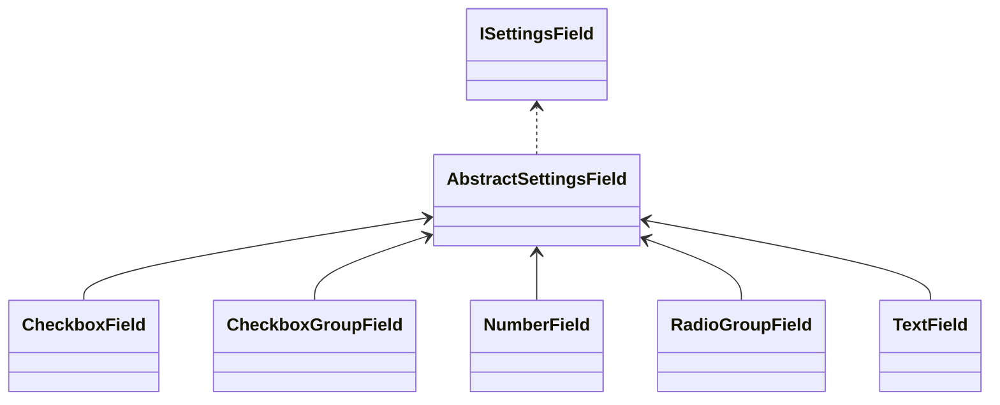

## Settings Page Builder

This is a simple settings page builder for WordPress. It is a wrapper around the WordPress Settings API. 
You can use it to create a settings page and merge different builders into one for better usage in feature plugins.

### Templates

The templates are located in the `templates` folder. You can use them to create your own fields or customize the page in general.

**wrapper.html.php:** The wrapper template for the settings page. It is used to wrap the whole page. 
**tablist.html.php:** The template for the tablist. It is used to render all added tabs. 

**fields/*:** The templates for the fields. They are used to render the fields. 

### Setting Fields
